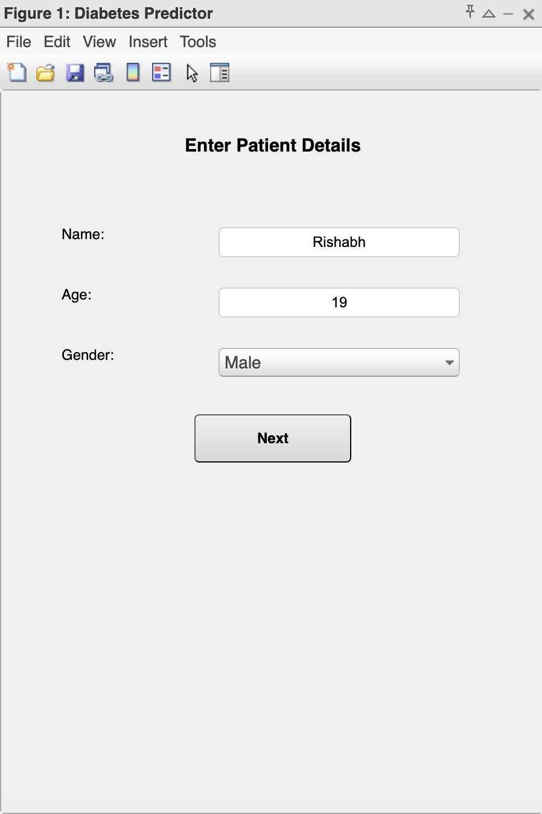
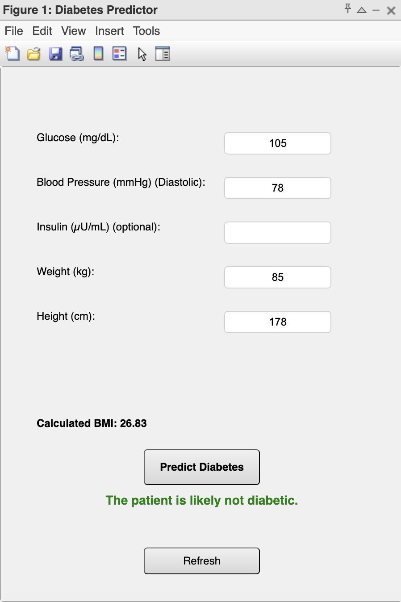
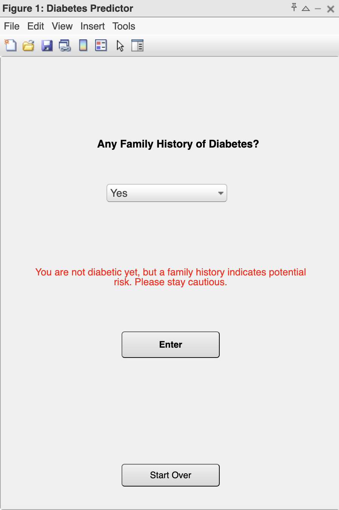

# Diabetes Prediction Using Data Science & Machine Learning (MATLAB)

This MATLAB-based project implements a diabetes prediction system using machine learning and an intuitive graphical user interface (GUI). Designed as part of a college assignment, it empowers users to quickly assess diabetes risk based on simple health metrics.

## Objective
To build an accessible, early-stage diabetes risk predictor using the **Pima Indian Diabetes Dataset**, making health screening more scalable and user-friendly — especially for remote or underserved areas.

## Tools & Technologies
- **MATLAB** (for scripting and GUI)
- **Statistics and Machine Learning Toolbox**
- **Random Forest (Bagged Trees Classifier)**
- GUI designed using `uicontrol` and `uipanel`

## Dataset
The Pima Indian Diabetes dataset (from Kaggle) includes 768 patient records with 9 key medical attributes:
- Pregnancies, Glucose, Blood Pressure, Skin Thickness, Insulin, BMI
- Diabetes Pedigree Function, Age
- Outcome (0 = Non-diabetic, 1 = Diabetic)

## Methodology

### Data Preprocessing
- Missing values (e.g., Insulin, Skin Thickness) replaced with averages.
- Z-score normalization applied to input features.

### Model
- **Random Forest (Bagged Ensemble)** classifier chosen for its robustness with tabular data.
- Trained on 70% of the dataset using `cvpartition` in MATLAB.

### Feature Engineering
- BMI is auto-computed from user-entered weight and height.
- GUI dynamically adjusts input fields (e.g., pregnancies only shown for female users).

### GUI Interface
Three interactive pages:
1. **User Info:** Name, Age, Gender
2. **Health Data:** Glucose, Blood Pressure, Weight, Height, Insulin, Pregnancies
3. **Family History (optional)**

Color-coded messages and a refresh button enhance usability.

### Home Screen

### Prediction Result

### Input Form

## Implementation Highlights
- Core script: `DiabetesPredictorUI.m`
- Full input validation, auto-calculated BMI, and clear result display.
- Result shown as **High Risk** / **Low Risk**, with recommendations if needed.

## Results
- Accurately flags diabetes likelihood from user inputs.
- Enhances medical accessibility through digital tools.

## How to Run
1. Clone/download this repository.
2. Open MATLAB and navigate to the project folder.
3. Run `DiabetesPredictorUI.m`.
4. Input sample data via GUI to get predictions.

## References
- [Pima Diabetes Dataset – Kaggle](https://www.kaggle.com/datasets/uciml/pima-indians-diabetes-database)
- [MathWorks: `fitcensemble`](https://www.mathworks.com/help/stats/fitcensemble.html)
- [MathWorks: `uicontrol`](https://www.mathworks.com/help/matlab/ref/uicontrol.html)

## Contact
For questions or collaboration: 

Email: rishabhrsingh19@gmail.com  
Linkedin: https://www.linkedin.com/rishabh-ranjan-singh

---

> *This project demonstrates how simple ML workflows in MATLAB can be turned into life-saving tools — fast, accessible, and effective.*
